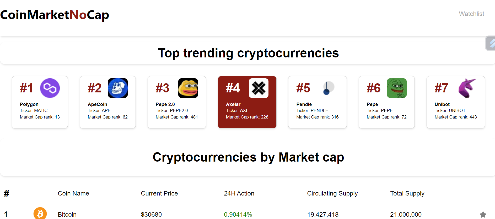

# [CoinMarketNoCap](https://coinmarketnocap.netlify.app/)

---

## Description

This project was a chance for me to explore my skills in React in order to create a website mimicking other crypto websites such as CoinMarketCap and CoinGecko. The website will display the top 100 cryptos and certain information about each. Also the user may add cryptos to their watchlist to keep an eye on them.

---

### Screenshot of completed site

The following image shows part of the web applications finished home appearance

The following image shows part of the web applications finished individual crypto page appearance

## Table of Contents

1. [Usage](#usage)
2. [License](#license)
3. [Questions](#questions)

---

## Usage

To use you mustly simply go to the website and explore! In its current form it is limited due to Coingecko API having a small cap for requests every 2 minutes.

---

## License

MIT

---

## Questions

In order to reach out for questions and feedback please use the following:

Github link: [BritishCryptoGuy](https://github.com/BritishCryptoGuy)

Email adress: Kieran_parkinson@hotmail.com

# Website Link

https://coinmarketnocap.netlify.app/
